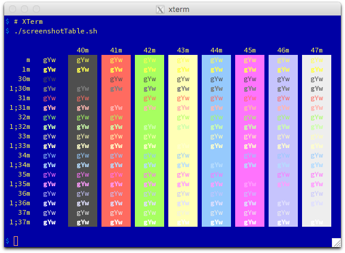
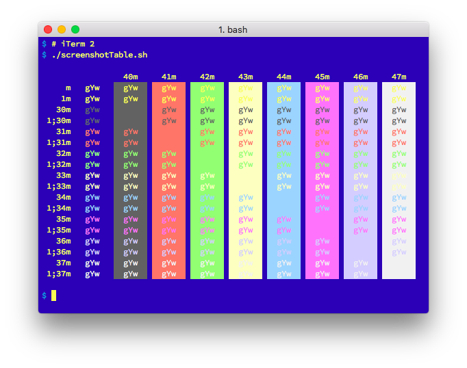

# Overview

[Hodler](https://en.wikipedia.org/wiki/Ferdinand_Hodler) converts
[iTerm 2](https://www.iterm2.com) color scheme [Property
Lists](https://en.wikipedia.org/wiki/Property_list) into forms that
the [Suckless Simple Terminal "st"](http://st.suckless.org) and
[X resources](https://en.wikipedia.org/wiki/X_resources)-based terminal
emulaters (e.g., [XTerm](http://invisible-island.net/xterm/)) can consume.

# Installation

Hodler is built using the [Go Programming Language](https://golang.org).  Go
is required to build and modify the tool.

    $ go get -u github.com/matttproud/hodler/cmd/hodler

Go generates staticly linked binaries, so users of Hodler needn't have Go
installed for casual use.

# Usage

Users of st can generate a fragment to embed into their local `config.h`.

    $ hodler -in adio.itermcolors -out config.h -output_format Suckless

Users of XTerm and other X resources systems will fancy this:

    $ hodler -in adio.itermcolors -out Xresources -output_format Xresources

# Examples

Borland theme in XTerm:

Reference case of Borland theme in iTerm 2:

# Build Status

