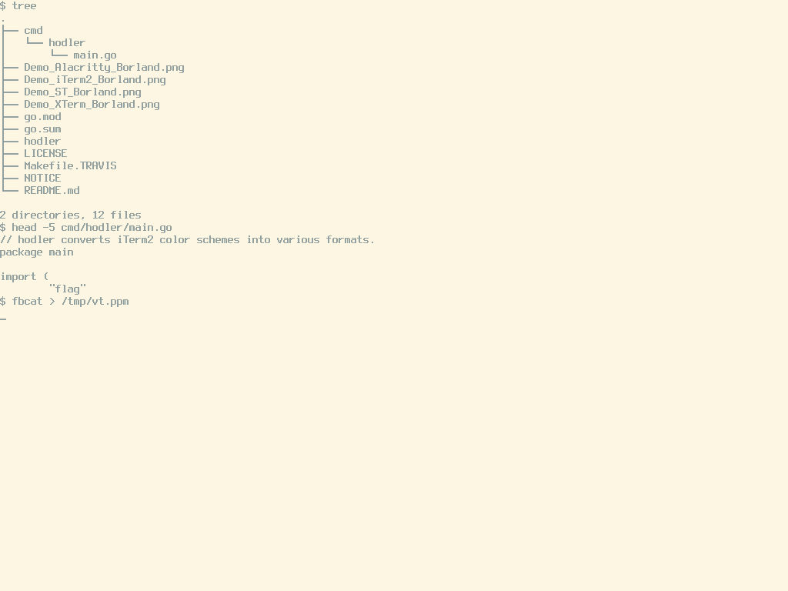

# Hodler

[Hodler](https://en.wikipedia.org/wiki/Ferdinand_Hodler) converts
[iTerm 2](https://www.iterm2.com) color scheme [Property
Lists](https://en.wikipedia.org/wiki/Property_list) into forms that
the [Suckless Simple Terminal "st"](http://st.suckless.org) and
[X resources](https://en.wikipedia.org/wiki/X_resources)-based terminal
emulaters (e.g., [XTerm](http://invisible-island.net/xterm/)) and
[Alacritty](https://github.com/jwilm/alacritty) and
Linux virtual terminal (virtual console) can consume.

The name comes from the Swiss painter Ferdinand Hodler:
https://www.artfritz.ch/MUSE/ZH_KH_hodlersaal_2020/index.html.

## Installation

Hodler is built using the [Go Programming Language](https://golang.org).  Go
is required to build and modify the tool.

    $ go install -v github.com/matttproud/hodler/cmd/hodler@latest

Go generates staticly linked binaries, so users of Hodler needn't have Go
installed for casual use.

## Usage

Users of st can generate a fragment to embed into their local `config.h`.

    $ hodler -in adio.itermcolors \
          -out config.h -output_format Suckless

Users of XTerm and other X resources systems will fancy this:

    $ hodler -in adio.itermcolors \
          -out Xresources -output_format Xresources

Users of Alacritty can generate a YAML fragment to embed into their local
`alacritty.yml`:

    $ hodler -in adio.itermcolors \
          -out alacritty.yml -output_format Alacritty

Users of Linux virtual terminal can generate a command line fragment to pass to
the kernel on boot:

    $ hodler -in adio.itermcolors \
          -out kernel.txt -output_format Kernel

## Examples

Borland theme in ST:

Borland theme in XTerm:

Borland theme in Alacritty:

Solarized Light on Linux Virtual Terminal:

Reference case of Borland theme in iTerm 2:

## Caveats

Not every output format is as expressive as iTerm 2's native capabilities.
Where Hodler knows fidelity will be lost, it remarks it as such in the output.

## Roadmap

I'd eventually like Hodler to be able to convert between various theme
formats universally and not be bound to iTerm 2 as input.  This is trickier
than it sounds due to some of the input formats not having a strong file format
to be relied upon, or at least a file format without considerable amounts of
extraneous fields to be filtered.

## Build Status

